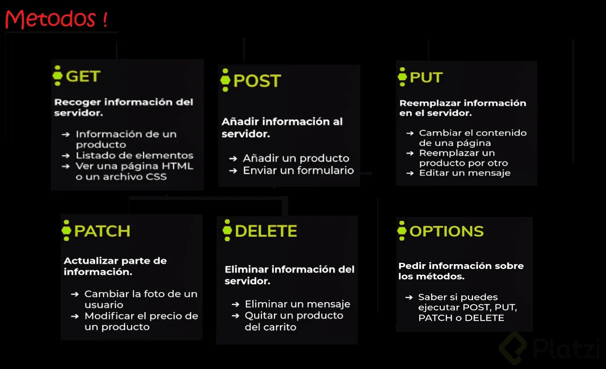
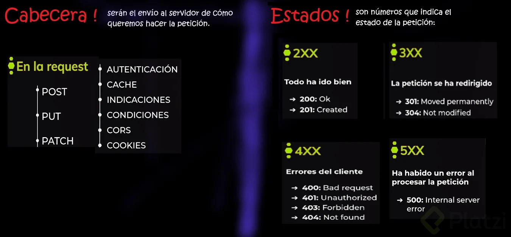
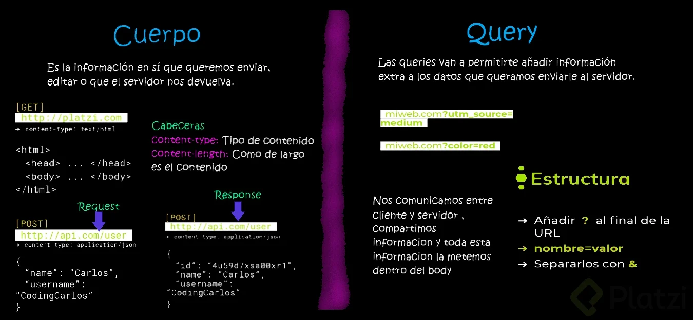
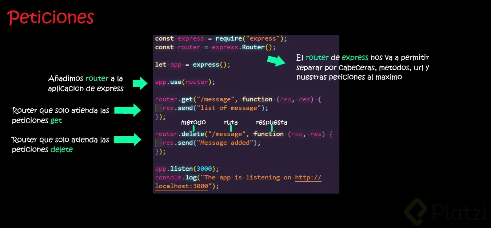
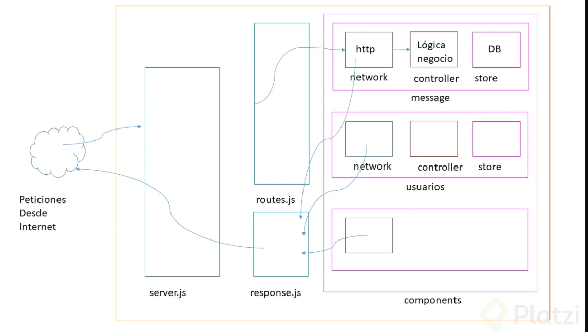
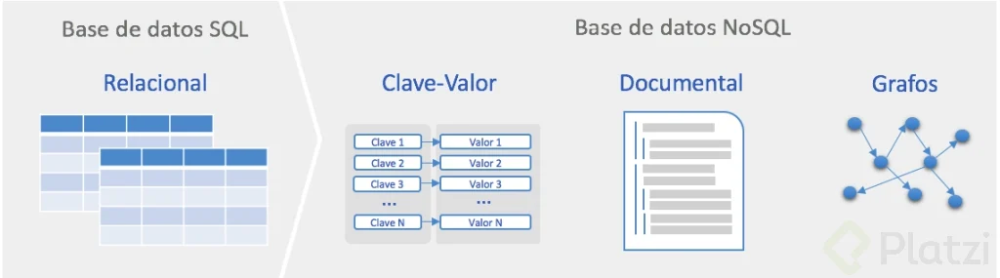

# curso-platzi-node

## Métodos, cabeceras y estados




## Cuerpo y query de la peticion

El cuerpo de la petición es la información en sí que queremos enviar, editar o que el servidor nos devuelva.

Las queries van a permitirte añadir información extra a los datos que queramos enviarle al servidor.



## Crear un servidor HTTP desde NodeJS

Primero que nada instalamos express, una libreria para crear servidores

```js
npm i express
```

Luego configuramos el server.js

```js
const express = require("express");

const app = express();

app.use("/", function (req, res) {
  res.send("Hola");
});

app.listen(3000);
console.log(`La aplicacion funciona en el puerto http://localhost:3000`);
```

Ahora ya podemos correr el server con

```js
  node server
```

## Como pueden venir las peticiones



## Recibir información desde el cliente: Body y Query

```js
const express = require("express");
const router = express.Router();

const app = express();

//Aca le pasas el content typq que quieras json, urlencoded, xml
app.use(express.json()); //Nos permite trabajar con la respuesta del body (obligatorio)
app.use(express.urlencoded({ extend: false }));
app.use(router);

router.get("/message", function (req, res) {
  res.send("Lista de mensajes");
});
router.post("/message", function (req, res) {
  console.log(req.body); // nos trae el body
  console.log(req.query); // nos trae el query
  res.send("Mensaje anadido");
});

app.listen(3000);
console.log(
  `La aplicacion funciona en el puerto http://localhost:3000/message`
);
```

Luego en insomia o lo que sea que uses le puedes pasar el content type y elquery


## Información contextual: Leer las cabeceras

```js
router.get("/message", function (req, res) {
  console.log(req.headers);
  //Agregamos cabeceras personalizadas
  res.header({
    "custom-header": "Nuestro valor personalizado",
  });
  res.send("Lista de mensajes");
});
```

## Tipos de respuesta: Vacía, plana, con datos y estructurada

Formas de enviar una respuesta del servidor al cliente: vacia, plana, estructurada.

```js
router.post("/message", function (req, res) {
  console.log(req.body);
  console.log(req.query);
  // res.send(); respuesta vacia
  // res.status(201).send(`Mensaje anadido correctamente`); // respuesta plana
  res.status(201).send({ error: "", body: "Creado correctamente" }); //respuesta estructurada
});
```

## Respuestas coherentes

Colacaremos todas nuestras respuestas en un solo sitio, para eso creamos response.js

```js
exports.success = function (req, res, message, status) {
  res.status(status || 200).send({
    error: "",
    body: message,
  });
};
exports.error = function (req, res, message, status) {
  res.status(status || 500).send({
    error: message,
    body: "",
  });
};
```

Luego para las llammos cuando necesitemos

server.js

```js
const response = require("./network/response");

const app = express();

//Aca le pasas el content typq que quieras json, urlencoded, xml
app.use(express.json()); //Nos permite trabajar con la respuesta del body (obligatorio)
app.use(express.urlencoded({ extend: false }));
app.use(router);

router.post("/message", function (req, res) {
  console.log(req.body);
  console.log(req.query);

  response.success(req, res, "Mensaje creado correctamente", 201);
});
```

## Servir archivos estáticos

Serviremos loso estaticos, html, css, javascript

Para eso usamos el servidor de estaticos de express

```js
app.use("/app", express.static("public"));
```

ahora podemos ver nuestro frontend en

http://localhost:3000/app/

## Errores: Cómo presentarlos e implicaciones en la seguridad

Debemos ser cuidadosos con la informacion que pasamos al cliente

Podemos manejar entre el error que se le muestra al usuario y el error que nos llega a nosotros

Asi, el usuario va a ver el message y nosotros el datail
server.js

```js
response.error(
  req,
  res,
  "Error inesperado",
  500,
  "Es solo una simulacion de los errrores"
);
```

respose.js

```js
exports.error = function (req, res, message, status, details) {
  console.error(`[response error] ${details}`);
  res.status(status || 500).send({
    error: message,
    body: "",
  });
};
```

## Arquitectura . Conceptualmente: Rutas, controladores y bases de datos



###### network:

Encarga de recibir la peticion http, procesar toda la informacion y enviarla al controlador

###### controller:

Se encarga de definir la logica, creando las funciones necesarias

Capa de presentación: la que ve el usuario (también se la denomina «capa de usuario»), Esta capa se comunica únicamente con la capa de negocio. (En este caso, seria el archivo network.js)

Capa de negocio: (En este caso, seria el archivo controller.js) Se denomina capa de negocio (e incluso de lógica del negocio) porque es aquí donde se establecen todas las reglas que deben cumplirse. Esta capa se comunica con la capa de presentación, para recibir las solicitudes y presentar los resultados, y con la capa de datos, para solicitar al gestor de base de datos almacenar o recuperar datos de él.

Capa de datos: En este caso, seria el archivo storge.js) es donde residen los datos y es la encargada de acceder a los mismos. Está formada por uno o más gestores de bases de datos que realizan todo el almacenamiento de datos, reciben solicitudes de almacenamiento o recuperación de información desde la capa de negocio.

## Tipos de Bases de Datos:

##### Bases de Datos Relacionales:

No es una base de datos muy flexible, pero tiene a favor su gran soporte y el enorme desarrollo en herramientas para su uso. Si necesitamos cambiar un valor de un campo debemos hacerlo con todos los campos de nuestra BD, en cambio con NoSQL o No Relacional no es así.

## Bases de Datos No Relacionales:

Son de bases de datos sin una tabla fija como las que sí se encuentran en las bases de datos relacionales, lo que permite una alta escalabilidad en ellas. Además, es abierta y por lo tanto flexible a diferentes tipos de datos y no necesita tantos recursos para ejecutarse; de hecho, el hardware necesario no cuesta mucho.



## MongoDB: Almacenar y leer datos

MongoDb no tiene esquemas pero no es una buena practica trabajar sin esquemas. Porque no sabemos que tipo de informacion va a ver en nuestra base de datos y es muy importante saber que estamos almacenando. Por eso usaremos una librerias llamada MOONGOSE que nos permitira crear esquemas, asi en caso que los datos no sean los correctos no lo guardara en la base de datos

## Subiendo archivos con multer

Primero que nada debemos instalar multer

```js
const path = require("path");
const multer = require("multer"); //Asi subimos archivos / imagenes a node

//Le decimos a multer en que carpeta va aguardar esos archivos,
//la otra funcion se encarga de quitarlo de binarios y le guarda con el nombre original
var storage = multer.diskStorage({
  destination: "public/files/",
  filename: function (req, file, cb) {
    cb(null, file.originalname);
  },
});

const upload = multer({ storage: storage });

//Luego cuando se lo pasas
router.post("/", upload.single("file"), function (req, res) {});
```
